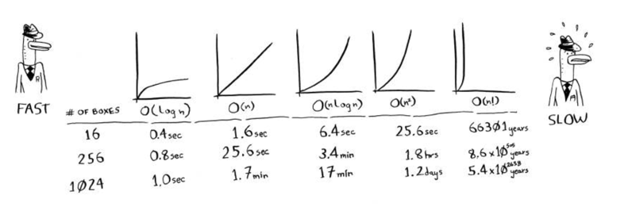

# Big O notation
- Big O notation is special notation that tells you how fast an algorithm is.
- *Big O notation lets you compare the number of operations.* It tells you how fast the algorithm grows.
- _O(log n)_ is number of operation for binary search algorithm is _log n_
- Big O notation is about the _worst-case_ scenario.
- Some common Big O run times sorted from fastest to slowest:
  - O(log n), also known as _log time_. Example: Binary search.
  - O(n), also known as _linear time_. Example: Simple search.
  - O(n*log n). Example: A fast sorting algorithm, like quicksort.
  - O(n^2). Example: A slow sorting algorithm, like selection sort.
  - O(n!). Example: A really slow algorithm, like the traveling salesperson.

- Algorithm speed isn't measured in seconds, but in growth of the number of operations
- Instead, we talk about how quickly the run time of an algorithm increases as the size of the input increases.
- Run time of algorithms is expressed in Big O notation.
- O(log n) is faster than O(n), but it gets a lot faster as the list of items you're search grows.
# Exercises

1. You have a name, and you want to ind the person’s phone number in the phone book.
- Answer: Binary search O(log n)
2. You have a phone number, and you want to ind the person’s name in the phone book. (Hint: You’ll have to search through the whole book!)
- Answer: linear time, simple  search, O(n)
3. You want to read the numbers of every person in the phone book.
- Answer: linear time, O(n)
4. You want to read the numbers of just the As. (his is a tricky one! It involves concepts that are covered more in chapter 4. Read the answer—you may be surprised!)
- Answer: 1/26 * n = linear time, O(n)