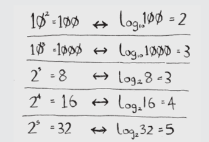

# Binary search
- its input is a sorted list of elements. If an element you're looking for is in that list, binary search returns the position where it's located. Otherwise, binary search returns null.
- Example: guess a number between 1 and 100. You have to try to guess this secret number in the fewest tries possible. With every guess, you can know if your guess is too high or too low or correct. Suppose you start guessing like this: 1,2,3,4... This is simple search. With each guess, you're eliminating only one number. If secret number was 99 it could take you 99 guesses to get there!
- Here's a better technique. Start with 50. Too low, but you just eliminated half the numbers! Now you know that 1-50 are all too low. Next guess: 75. Too high, but again you cut down half the remaining numbers! With binary search, you guess the middle number and eliminate half the remaining numbers every time. Next is 63 (halfway between 50 and 75).
- This is binary search. In general, for any list of n, binary search will take log2n steps to run in the worst case, whereas simple search will take n steps.
- *Logarithms* log10 100 is like asking, "How many 10s do we multiply together to get 100?" The answer is 2: 10*19. So log10 100 = 2. Logs are the flip of exponentials.

## Exercise
1. Suppose you have a sorted list of 128 names, and you’re searching through it using binary search. What’s the maximum number of steps it would take?
- answer: _log2 128_ = 7 
2. Suppose you double the size of the list. What’s the maximum number of steps now?
- answer: _log2 256_ = 8
